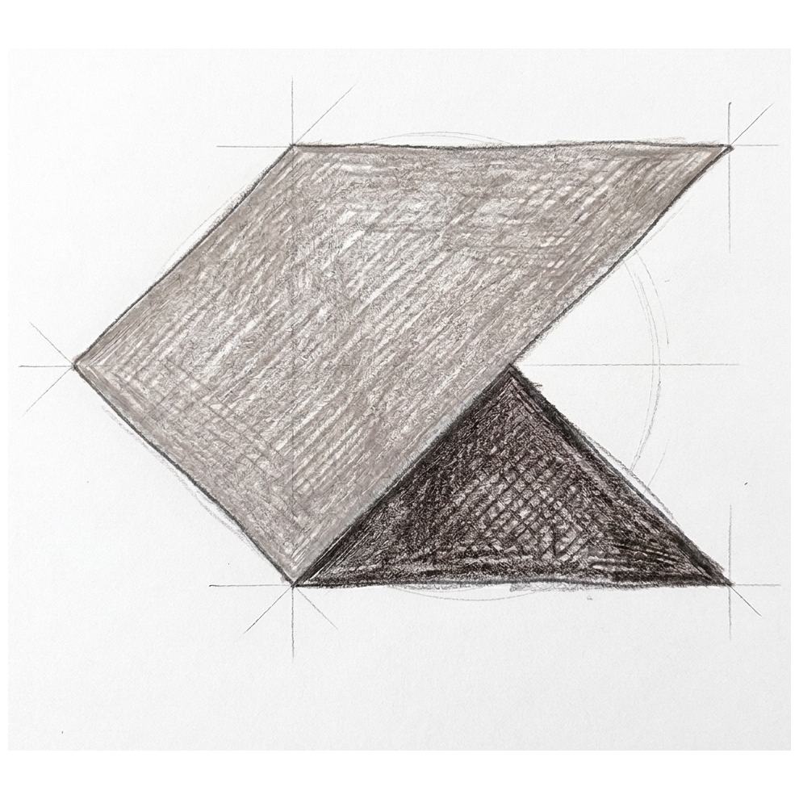
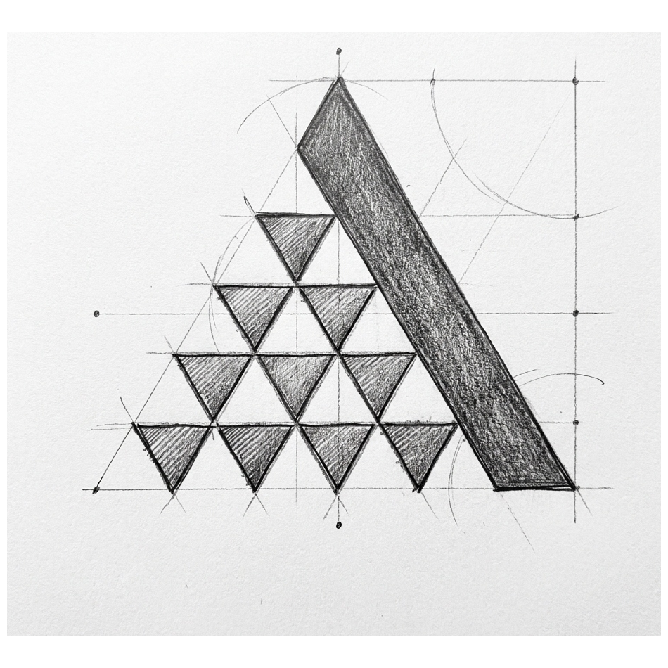
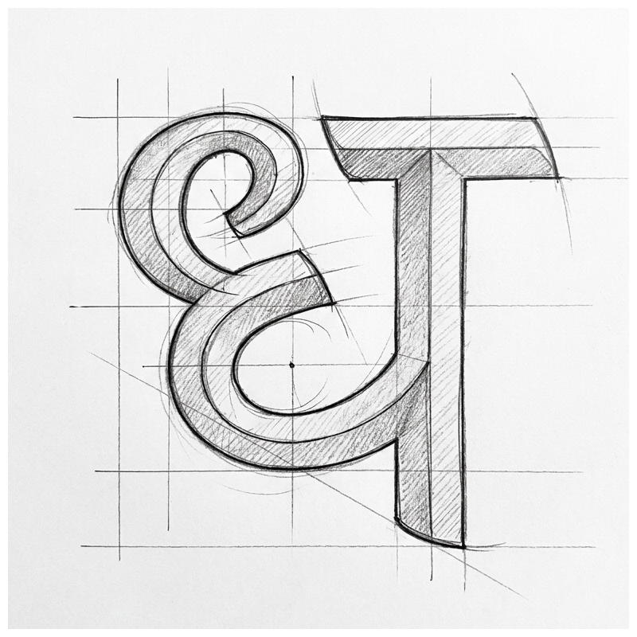
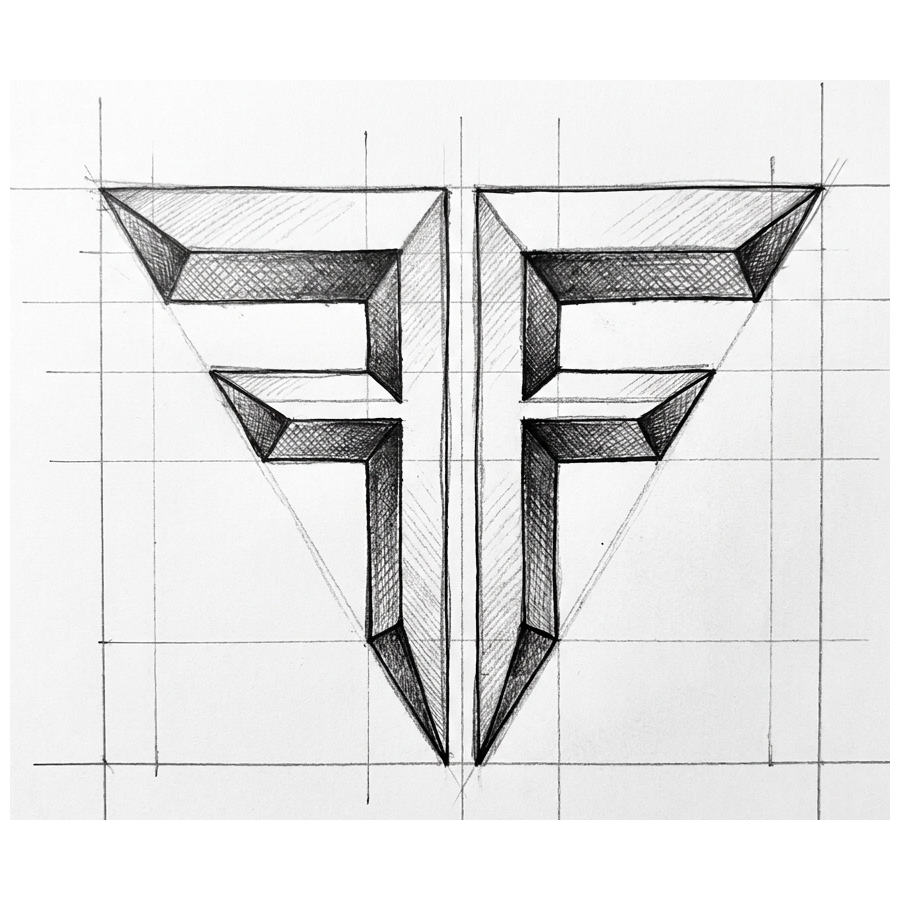
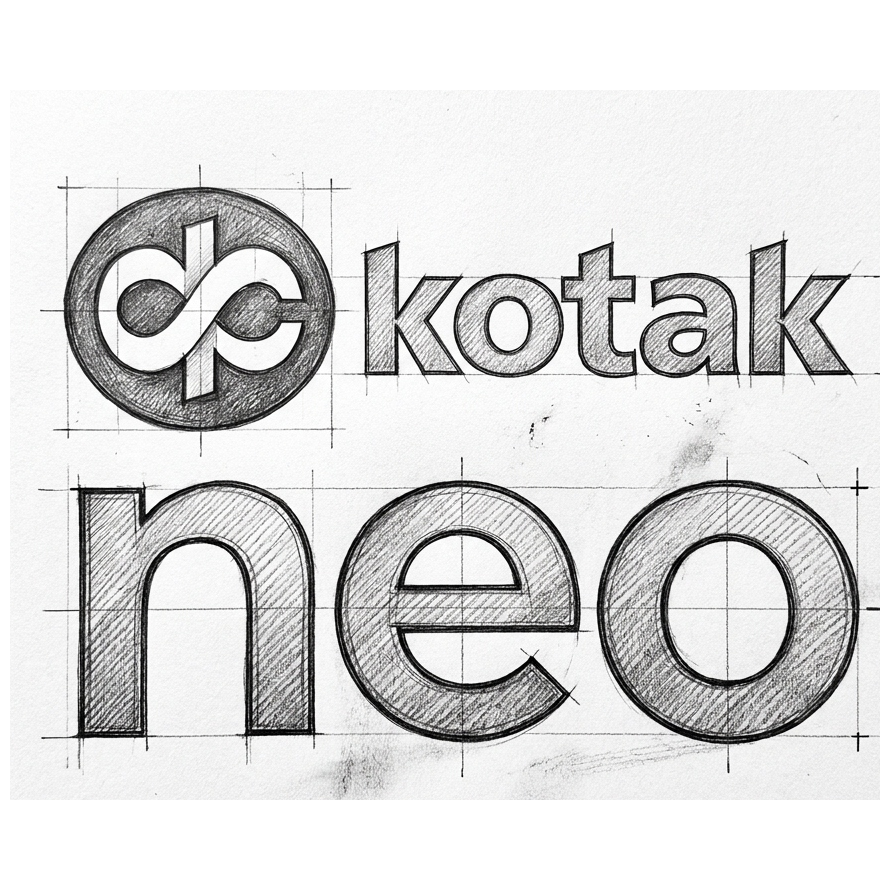

# Indian Broker Gateways Architecture & Directory Index

This directory contains modular, end-to-end technical specifications for all 8 Indian broker APIs supported by ViewMarket. Each broker has a dedicated directory covering authentication flows, WebSocket streaming protocols, order execution, fund endpoints, and symbol master sources.

---

## Modular Directory Index

| Broker | Subdirectory | Topics Covered | Key Architectural Attribute |
| :--- | :--- | :--- | :--- |
|  **Zerodha** | [`zerodha/`](zerodha/) | [`authentication.md`](zerodha/authentication.md) [`websocket.md`](zerodha/websocket.md) [`orders-and-data.md`](zerodha/orders-and-data.md) | Binary Protobuf WS, OAuth 2.0, Daily 06:00 AM expiry |
|  **Angel One** | [`angelone/`](angelone/) | [`authentication.md`](angelone/authentication.md) [`websocket.md`](angelone/websocket.md) [`orders-and-data.md`](angelone/orders-and-data.md) | Dedicated `feedToken`, free historical candles, MPIN+TOTP |
|  **Upstox** | [`upstox/`](upstox/) | [`authentication.md`](upstox/authentication.md) [`websocket.md`](upstox/websocket.md) [`orders-and-data.md`](upstox/orders-and-data.md) | Dynamic signed Protobuf WS URL, OAuth 2.0, Option Greeks |
|  **Dhan** | [`dhan/`](dhan/) | [`specification.md`](dhan/specification.md) | Sub-ms packet-optimized binary stream, 30-day static tokens |
|  **Fyers** | [`fyers/`](fyers/) | [`specification.md`](fyers/specification.md) | TradingView native format, separate Data & Order sockets |
|  **Kotak Neo** | [`kotakneo/`](kotakneo/) | [`specification.md`](kotakneo/specification.md) | Zero-brokerage intraday, HSM secure socket, bank reliability |
|  **ICICI Direct** | [`icicidirect/`](icicidirect/) | [`specification.md`](icicidirect/specification.md) | Socket.io streaming, 1-second OHLC bars, 10-year tick depth |
|  **Shoonya** | [`shoonya/`](shoonya/) | [`specification.md`](shoonya/specification.md) | Lifetime ₹0 F&O, zero manual browser redirect (QuickAuth) |

---

## Cross-Broker Core Specifications
- **[Exchange Timings, AMO Windows & API Rate Limits](EXCHANGE_TIMINGS_AND_RATE_LIMITS.md)**: Official NSE/BSE regular, pre-open, and MCX trading hours, broker-by-broker After Market Order (AMO) schedules, request-per-second throttling thresholds, and universal API error codes.

---

## Common Non-Custodial Architecture Principles

1. **Zero Database Credential Persistence**:
   - Neither API Keys, API Secrets, nor TOTP secrets are persisted to database tables.
   - Credentials remain client-side or reside in ephemeral encrypted session memory.

2. **Mandatory Confirmation Layer (Click-to-Trade)**:
   - In compliance with Indian regulatory guidance, AI agents and automated strategies emit pending orders requiring explicit human authorization.
