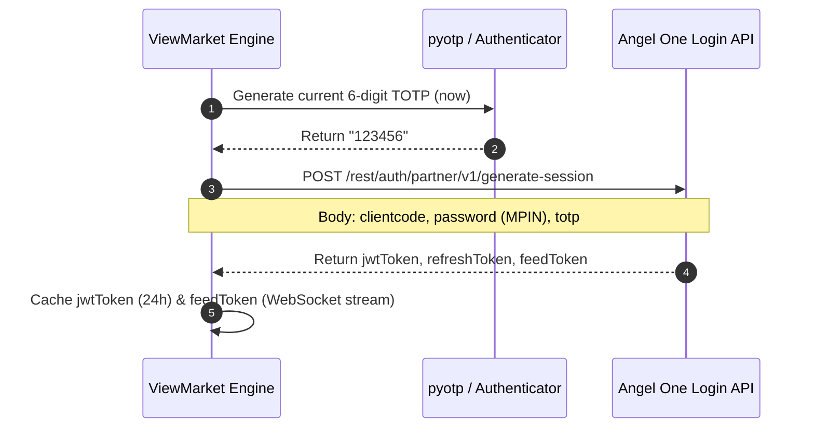

# Angel One (SmartAPI v2) - Authentication Specification

<p align="left">
  
</p>

## 1. Overview & Required Credentials
Angel One SmartAPI supports headless, programmatic session creation without mandatory daily browser redirects.

| Credential | Type | Required | Description |
| :--- | :--- | :--- | :--- |
| `apiKey` | String | Yes | Historical / Trading API Key from SmartAPI Portal |
| `clientCode` | String | Yes | Angel One Client Code (e.g. `A109482`) |
| `password` | String | Yes | 4-digit MPIN |
| `totpKey` | String | Yes | Base32 TOTP secret key for automated 2FA |

---

## 2. Authentication Lifecycle



### Session Request
- **Method**: `POST`
- **Endpoint**: `https://apiconnect.angelbroking.com/rest/auth/partner/v1/generate-session`
- **Headers**:
  ```http
  Content-Type: application/json
  Accept: application/json
  X-UserType: USER
  X-SourceID: WEB
  X-ClientLocalIP: 127.0.0.1
  X-ClientPublicIP: 106.51.78.20
  X-MACAddress: 00:00:00:00:00:00
  X-PrivateKey: {apiKey}
  ```
- **Body**:
  ```json
  {
    "clientcode": "A109482",
    "password": "1234",
    "totp": "654321"
  }
  ```

---

## 3. Response Structure & Tokens

```json
{
  "status": true,
  "message": "SUCCESS",
  "errorcode": "",
  "data": {
    "jwtToken": "eyJhbGciOi...",
    "refreshToken": "eyJhbGciOi...",
    "feedToken": "09823487123"
  }
}
```

### Token Lifecycle & Expiration
- **`jwtToken`**: Bearer token passed in the `Authorization` header for all REST operations. Valid for **24 hours**.
  ```http
  Authorization: Bearer {jwtToken}
  ```
- **`feedToken`**: Required exclusively for the **WebSocket Streaming connection**.
- **`refreshToken`**: Used to renew `jwtToken` without re-entering MPIN/TOTP:
  - `POST https://apiconnect.angelbroking.com/rest/auth/partner/v1/generate-token`
  - Body: `{"refreshToken": "..."}`
