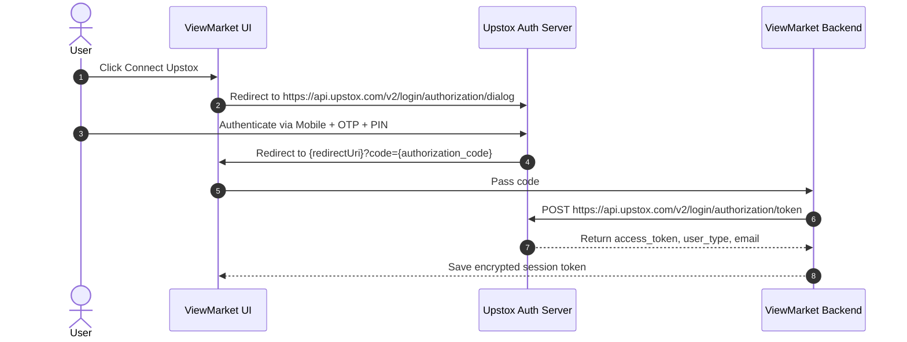

# Upstox (API v2 / v3) - Authentication Specification

<p align="left">
  
</p>

## 1. Overview & Required Credentials
Upstox strictly adheres to OAuth 2.0 Authorization Code flow.

| Credential | Type | Required | Description |
| :--- | :--- | :--- | :--- |
| `apiKey` | String | Yes | Client ID from Upstox Developer Console |
| `apiSecret` | String | Yes | Client Secret |
| `redirectUri` | String | Yes | Exact whitelisted Redirect URI |

---

## 2. Authentication Lifecycle



### Authorization URL
```
https://api.upstox.com/v2/login/authorization/dialog?response_type=code&client_id={apiKey}&redirect_uri={redirectUri}
```

### Token Exchange Request
- **Endpoint**: `POST https://api.upstox.com/v2/login/authorization/token`
- **Headers**:
  ```http
  Content-Type: application/x-www-form-urlencoded
  Accept: application/json
  ```
- **Body**:
  ```
  code={code}&client_id={apiKey}&client_secret={apiSecret}&redirect_uri={redirectUri}&grant_type=authorization_code
  ```

---

## 3. Response & Token Validity
```json
{
  "email": "user@example.com",
  "user_name": "Trader Name",
  "user_id": "208492",
  "user_type": "individual",
  "is_active": true,
  "access_token": "eyJhbGciOi...",
  "extended_token": null
}
```

### Expiration
- Access tokens expire automatically every day at **03:30 AM IST**.
- For all REST requests:
  ```http
  Authorization: Bearer {access_token}
  ```
