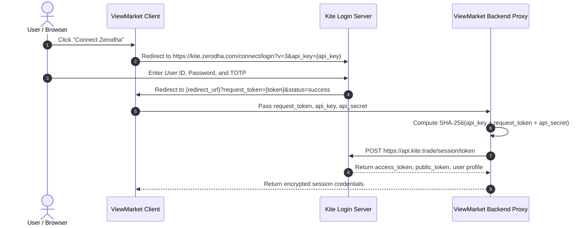

# Zerodha (Kite Connect v3) - Authentication Specification

<p align="left">
  
</p>


## 1. Overview & Required Credentials
To authenticate against Zerodha's Kite Connect API, the user must provision an app from the [Kite Developer Portal](https://developers.kite.trade).

| Parameter | Type | Required | Description |
| :--- | :--- | :--- | :--- |
| `api_key` | String | Yes | Public app identifier |
| `api_secret` | String | Yes | Secret salt used for SHA-256 checksum generation |
| `user_id` | String | Yes | Zerodha 6-character client ID (e.g. `ZM1024`) |
| `redirect_url` | String | Yes | Whitelisted callback URL on developer console |

---

## 2. Authentication Lifecycle Flow



### Checksum Computation
```python
import hashlib

checksum = hashlib.sha256(
    (api_key + request_token + api_secret).encode("utf-8")
).hexdigest()
```

### Session Token Exchange
- **Method**: `POST`
- **Endpoint**: `https://api.kite.trade/session/token`
- **Headers**:
  ```http
  X-Kite-Version: 3
  Content-Type: application/x-www-form-urlencoded
  ```
- **Body**:
  ```
  api_key={api_key}&request_token={request_token}&checksum={checksum}
  ```

---

## 3. Response Structure & Token Expiry
```json
{
  "status": "success",
  "data": {
    "user_type": "individual",
    "email": "trader@example.com",
    "user_name": "Ayush Kumar",
    "user_shortname": "Ayush",
    "broker": "ZERODHA",
    "exchanges": ["NSE", "NFO", "BSE", "BFO", "CDS", "MCX"],
    "products": ["CNC", "NRML", "MIS"],
    "order_types": ["MARKET", "LIMIT", "SL", "SL-M"],
    "api_key": "your_api_key",
    "access_token": "a1b2c3d4e5f6g7h8i9j0...",
    "public_token": "pub_token_here",
    "refresh_token": ""
  }
}
```

### Token Expiration Rules
- **Daily Expiry**: Kite Connect `access_token` automatically expires every morning between **06:00 AM and 07:00 AM IST**.
- **Forced Invalidation**: If the user logs out from Kite Web or another session, existing tokens may be revoked.
- **Header for Subsequent Requests**:
  ```http
  Authorization: token {api_key}:{access_token}
  ```
